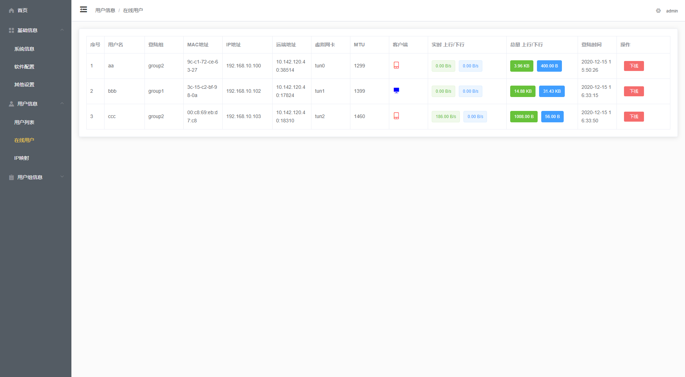
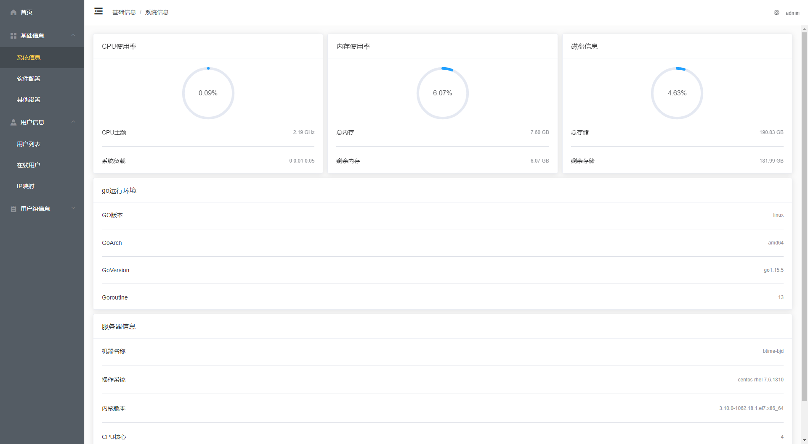
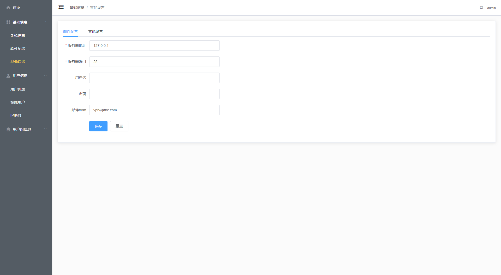
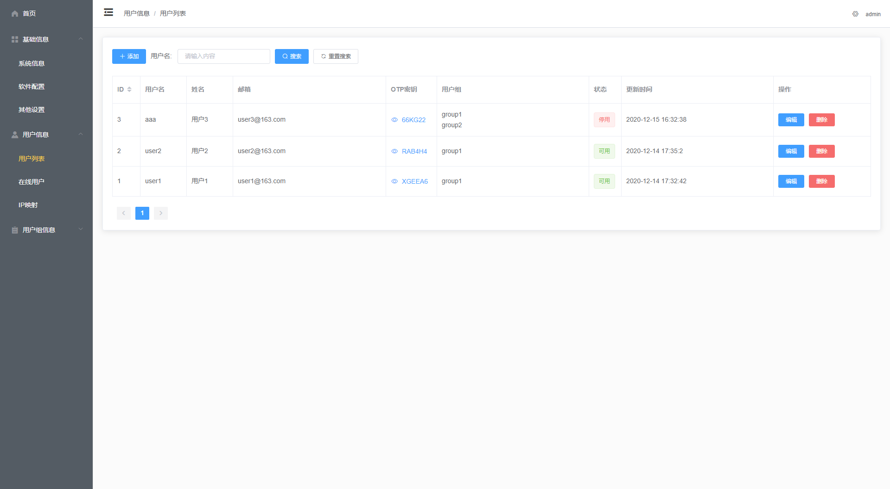
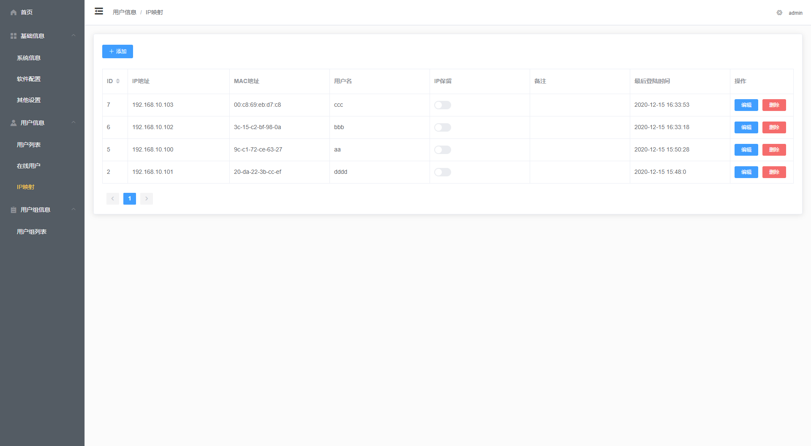
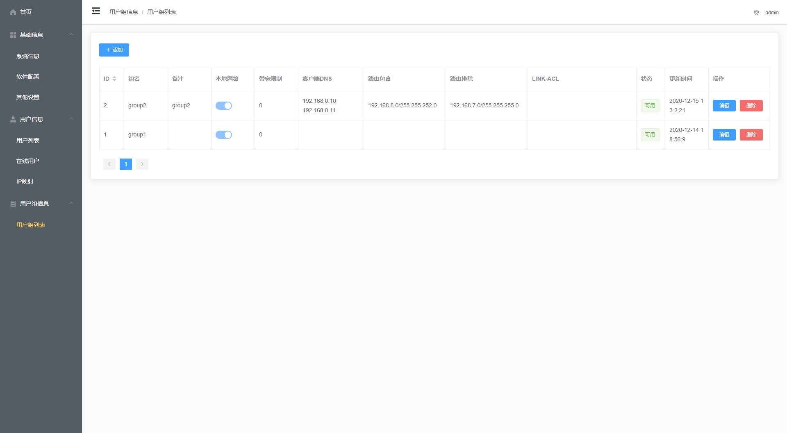

# AnyLink

AnyLink 是一个企业级远程办公sslvpn的软件，可以支持多人同时在线使用。

## Introduction

AnyLink 基于 [ietf-openconnect](https://tools.ietf.org/html/draft-mavrogiannopoulos-openconnect-03)
协议开发，并且借鉴了 [ocserv](http://ocserv.gitlab.io/www/index.html) 的开发思路，使其可以同时兼容 AnyConnect 客户端。

## Screenshot



## Installation

> 升级 go version = 1.15
>
> 需要提前安装好 golang 和 nodejs

```shell
git clone https://github.com/go-kiss/anylink.git

cd anylink
sh build.sh

# 注意使用root权限运行
cd anylink-deploy
sudo ./anylink -conf="conf/server.toml"

# 默认管理后台访问地址
# http://host:8800
# 默认账号密码
# admin 123456
```

## Feature

- [x] IP分配(实现IP、MAC映射信息的持久化)
- [x] TLS-TCP通道
- [x] DTLS-UDP通道
- [x] 兼容AnyConnect
- [x] 用户组支持
- [x] 多用户支持
- [x] TOTP令牌支持
- [x] 流量控制
- [x] 后台管理界面
- [x] 访问权限管理

## Config

默认配置文件内有详细的注释，根据注释填写配置即可。

```shell
# 生成后台密码
./anylink tool -p 123456

# 生成jwt密钥
./anylink tool -s
```

[conf/server.toml](server/conf/server.toml)

## Systemd

添加 systemd脚本

* anylink 程序目录放入 `/usr/local/anylink-deploy`

systemd 脚本放入：

* centos: `/usr/lib/systemd/system/`
* ubuntu: `/lib/systemd/system/`

操作命令:

* 启动: `systemctl start anylink`
* 停止: `systemctl stop anylink`
* 开机自启: `systemctl enable anylink`

## Docker

1. 获取镜像

   ```bash
   docker pull go-kiss/anylink:latest
   ```

2. 生成密码

   ```bash
   docker run -it --rm go-kiss/anylink tool -p 123456
   #Passwd:$2a$10$lCWTCcGmQdE/4Kb1wabbLelu4vY/cUwBwN64xIzvXcihFgRzUvH2a
   ```

3. 生成jwt secret

   ```bash
   docker run -it --rm go-kiss/anylink tool -s
   #Secret:9qXoIhY01jqhWIeIluGliOS4O_rhcXGGGu422uRZ1JjZxIZmh17WwzW36woEbA
   ```

4. 启动容器

   ```bash
   docker run -itd --name anylink --privileged \
   -p 443:443 -p 8800:8800 \
   --restart=always \
   go-kiss/anylink
   ```

5. 使用自定义参数启动容器

   ```bash
   docker run -itd --name anylink --privileged \
   -e IPV4_CIDR=192.168.10.0/24 \
   -p 443:443 -p 8800:8800 \
   --restart=always \
   go-kiss/anylink \
   -c=/etc/server.toml --admin_addr=:8080
   ```

6. 构建镜像

   ```bash
   #获取仓库源码
   git clone https://github.com/go-kiss/anylink.git
   # 构建镜像
   docker build -t anylink .
   ```

## Setting

1. 开启服务器转发

 ```shell
 # flie: /etc/sysctl.conf
 net.ipv4.ip_forward = 1

 #执行如下命令
 sysctl -w net.ipv4.ip_forward=1
 ```

2. 设置nat转发规则

```shell
# eth0为服务器内网网卡
iptables -t nat -A POSTROUTING -s 192.168.10.0/24 -o eth0 -j MASQUERADE
```

3. 使用AnyConnect客户端连接即可

## Contribution

欢迎提交 PR、Issues，感谢为AnyLink做出贡献。 

## Other Screenshot

<details>
<summary>展开查看</summary>







</details>
